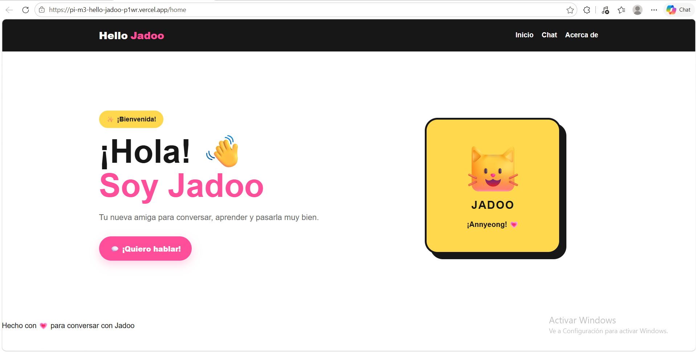
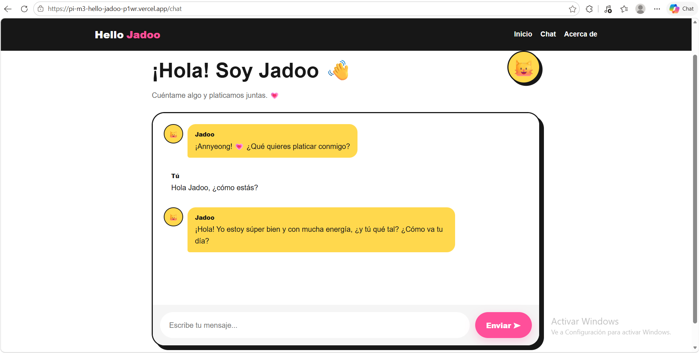
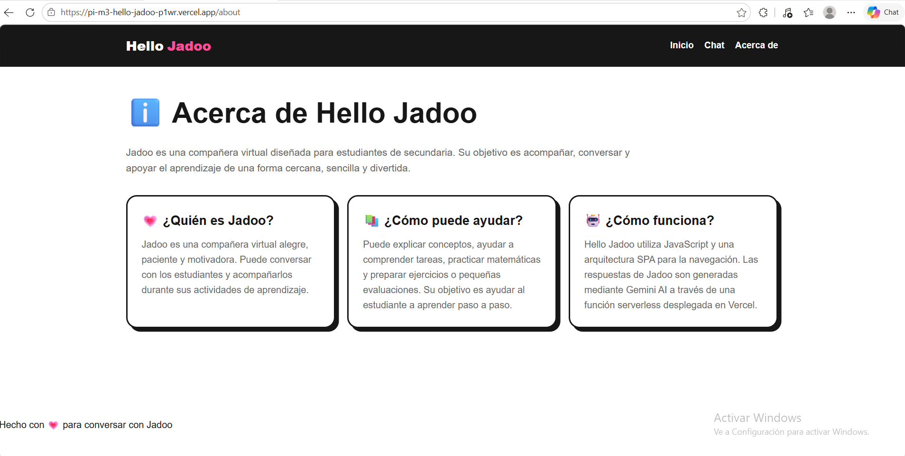

# Hello Jadoo 💗

## Proyecto Integrador - Módulo 3

Hello Jadoo es una aplicación web tipo **SPA (Single Page Application)** que permite interactuar con **Jadoo**, una compañera virtual educativa dirigida principalmente a estudiantes de secundaria.

La aplicación utiliza **Google Gemini** para generar respuestas conversacionales y cuenta con una función **Serverless** desplegada en **Vercel**, manteniendo la clave de acceso protegida mediante variables de entorno.

---

## 📚 Descripción del proyecto

Hello Jadoo fue desarrollada como una aplicación web orientada a acompañar a estudiantes de secundaria durante sus actividades de aprendizaje.

Jadoo puede:

- Resolver dudas académicas.
- Orientar al estudiante en sus tareas.
- Explicar conceptos de forma sencilla.
- Ayudar con ejercicios de matemáticas.
- Apoyar la preparación académica.
- Mantener el contexto de la conversación durante la sesión.
- Conversar de manera natural sobre diferentes temas.

Cuando el estudiante solicita ayuda con una actividad académica, Jadoo está configurada para orientar el proceso y favorecer la comprensión, en lugar de limitarse a proporcionar una respuesta inmediata.

La aplicación utiliza una arquitectura SPA para la navegación y una función Serverless para comunicarse con Google Gemini sin exponer la clave de API en el frontend.

---

## ✨ Características

- SPA (Single Page Application).
- Navegación mediante History API.
- Navegación sin recargar la página.
- Soporte para los botones Atrás y Adelante del navegador.
- Rutas:
  - `/home`
  - `/chat`
  - `/about`
- Chat interactivo con Jadoo.
- Historial de conversación durante la sesión.
- Indicador de estado `escribiendo...`.
- Manejo de errores de comunicación con la API.
- Auto-scroll del área de conversación.
- Diseño responsive.
- Enfoque mobile-first.
- Integración con Google Gemini.
- Función Serverless en Vercel.
- Variables de entorno para información sensible.
- Pruebas unitarias con Vitest.

---

## 🧠 Jadoo

Jadoo es una compañera virtual educativa dirigida principalmente a estudiantes de secundaria.

Su personalidad está diseñada para ser:

- Alegre.
- Amable.
- Paciente.
- Cercana.
- Motivadora.
- Divertida.

Jadoo busca acompañar al estudiante durante su aprendizaje.

### Apoyo académico

Cuando el estudiante solicita ayuda con una actividad académica, Jadoo está configurada para:

1. Identificar qué debe resolver el estudiante.
2. Explicar el concepto necesario.
3. Hacer preguntas sencillas.
4. Permitir que el estudiante intente resolver el ejercicio.
5. Evaluar su respuesta.
6. Reconocer los avances.
7. Proporcionar pistas cuando sea necesario.
8. Permitir nuevos intentos.

El objetivo es favorecer el aprendizaje y la comprensión del procedimiento.

---

## 🛠️ Tecnologías utilizadas

### Frontend

- HTML5
- CSS3
- JavaScript
- Vite
- History API
- Fetch API
- Flexbox
- CSS Grid
- Media Queries

### Inteligencia artificial

- Google Gemini
- Google GenAI SDK

### Backend y API

- Node.js
- Express
- Vercel Functions

### Base de datos y desarrollo

- PostgreSQL
- pgAdmin
- node-postgres (`pg`)

PostgreSQL se mantiene como parte de la infraestructura de desarrollo del proyecto para las funcionalidades académicas de evaluación y práctica.

La comunicación principal del chat con Jadoo no depende de PostgreSQL. El chat utiliza directamente la Serverless Function y el servicio de Gemini.

### Pruebas

- Vitest

### Control de versiones

- Git
- GitHub

### Despliegue

- Vercel

---

## 📁 Estructura del proyecto

```text
PI_M3_HelloJadoo/
│
├── api/
│   ├── app.js
│   ├── chat-service.js
│   ├── functions.js
│   ├── server.js
│   ├── server-pi.js
│   └── server-pi-local.js
│
├── db/
│   ├── config.js
│   ├── queries.js
│   ├── test-connection.js
│   ├── test-practice.js
│   └── test-queries.js
│
├── src/
│   ├── app.js
│   ├── chat.js
│   ├── chatApi.js
│   ├── evaluation.js
│   ├── index.html
│   ├── router.js
│   ├── styles.css
│   ├── utils.js
│   └── welcome.js
│
├── tests/
│   └── prueba.test.js
│
├── screenshots/
│   ├── home.png
│   ├── chat.png
│   └── about.png
│
├── .env.example
├── .gitignore
├── package.json
├── package-lock.json
├── README.md
├── server.js
├── vercel.json
└── vite.config.js
```
## 📸 Capturas de pantalla

### 🏠 Inicio

Página principal de Hello Jadoo, donde se presenta a Jadoo y se puede acceder al chat.



### 💬 Chat

Interfaz de conversación entre el estudiante y Jadoo utilizando Google Gemini.



### ℹ️ Acerca de

Información sobre Jadoo, sus funciones y la tecnología utilizada en el proyecto.



---

## ⚙️ Instalación y ejecución

### Requisitos

Para ejecutar el proyecto localmente se requiere:

- Node.js
- npm
- Git
- Una API Key de Google Gemini

### 1. Clonar el repositorio

```bash
git clone https://github.com/jhovany50-lab/PI_M3_HelloJadoo.git
```

### 2. Entrar al proyecto

```bash
cd PI_M3_HelloJadoo
```

### 3. Instalar dependencias

```bash
npm install
```

### 4. Configurar variables de entorno

Crear un archivo:

```text
.env
```

Tomar como referencia el archivo:

```text
.env.example
```

Agregar la clave de Google Gemini:

```env
GEMINI_API_KEY=tu_api_key_aqui
```

El archivo `.env` contiene información sensible y se encuentra incluido en `.gitignore`.

### 5. Ejecutar el frontend

```bash
npm run dev
```

El frontend estará disponible en:

```text
http://localhost:5173
```

### 6. Ejecutar la API local

En otra terminal:

```bash
node api/server-pi-local.js
```

La API estará disponible en:

```text
http://localhost:3000
```

### 7. Ejecutar con Vercel Dev

También se puede utilizar el entorno local de Vercel:

```bash
vercel dev
```

---

## 🤖 Integración con Google Gemini

Hello Jadoo utiliza **Google Gemini** para generar las respuestas de la compañera virtual.

### Arquitectura de comunicación

El flujo de comunicación del chat se organiza de la siguiente manera:

Frontend
→ `src/chat.js`
→ `src/chatApi.js`
→ `POST /api/functions`
→ `api/functions.js`
→ `api/chat-service.js`
→ Google Gemini

`src/chat.js` gestiona la interfaz del chat y el historial de la conversación.

`src/chatApi.js` realiza la petición HTTP al endpoint `/api/functions`.

`api/functions.js` funciona como Serverless Function en Vercel y recibe el mensaje, el historial y la información de personalización.

`api/chat-service.js` concentra la configuración de Gemini y el `systemInstruction` de Jadoo. Desde este servicio se realiza la comunicación con Google Gemini.

La clave `GEMINI_API_KEY` permanece únicamente en el servidor y no se envía desde el navegador.

La comunicación se realiza mediante una función Serverless ubicada en:

```text
api/functions.js
```

El frontend realiza una petición:

```text
POST /api/functions
```

La petición contiene:

- El mensaje actual del estudiante.
- El historial de conversación.
- La información de personalización del estudiante cuando está disponible.

La función Serverless recibe la información y utiliza Google Gemini para generar la respuesta.

### Prompt de sistema

Jadoo utiliza un prompt de sistema que define su comportamiento como compañera virtual educativa.

Entre sus principales instrucciones se encuentran:

- Mantener una personalidad alegre, amable y paciente.
- Conversar de manera natural.
- No saludar repetidamente.
- Ayudar al estudiante paso a paso.
- Favorecer la comprensión antes de proporcionar una respuesta final.
- Utilizar el historial de conversación.
- No inventar información académica.
- Utilizar lenguaje apropiado para estudiantes de secundaria.
- Apoyar ejercicios y preparación académica.

### Historial de conversación

El historial se mantiene durante la sesión.

Esto permite que Jadoo pueda interpretar respuestas breves utilizando el contexto anterior.

Por ejemplo:

```text
Estudiante: ¿Cuánto es 3 + 2?

Jadoo: ¿Cuánto crees que es?

Estudiante: 5
```

Jadoo puede interpretar el mensaje `5` utilizando el contexto de la conversación.

---

## 💬 Experiencia de chat

La interfaz diferencia visualmente los mensajes del estudiante y los mensajes de Jadoo.

Durante la espera de la respuesta de Gemini se muestra el indicador:

```text
escribiendo...
```

También se implementaron:

- Limpieza del campo de entrada después de enviar.
- Auto-scroll de la conversación.
- Manejo de errores de comunicación.
- Validación de mensajes vacíos.
- Historial de conversación durante la sesión.

---

## 🧭 Navegación SPA

Hello Jadoo utiliza **History API** para realizar la navegación sin recargar la página.

Las rutas principales son:

```text
/home
/chat
/about
```

La navegación utiliza:

```javascript
history.pushState()
```

y:

```javascript
popstate
```

Esto permite utilizar los botones **Atrás** y **Adelante** del navegador.

---

## 📱 Diseño responsive

El proyecto utiliza un enfoque **mobile-first**.

Se implementaron:

- Flexbox.
- CSS Grid.
- Media Queries.
- Diseño adaptable para diferentes tamaños de pantalla.
- Navegación adaptable en dispositivos pequeños.

La interfaz fue revisada en diferentes tamaños de pantalla para comprobar la adaptación del contenido.

### 📐 Tamaños de prueba

La interfaz fue probada en tres tamaños de pantalla representativos:

| Dispositivo | Resolución |
|---|---:|
| 📱 Móvil | 375 × 667 px |
| 📱 Tablet | 768 × 1024 px |
| 🖥️ Desktop | 1440 × 900 px |

En los tres tamaños se verificó:

- Navegación entre las vistas `/home`, `/chat` y `/about`.
- Visualización correcta de los contenidos.
- Uso del formulario de chat.
- Adaptación de las burbujas de conversación.
- Ausencia de desbordamiento horizontal.
- Legibilidad y distribución de los elementos.

---

## 🧪 Pruebas unitarias

El proyecto utiliza **Vitest** para las pruebas unitarias.

Para ejecutar las pruebas:

```bash
npm test -- --run
```

### Pruebas realizadas

Las pruebas verifican diferentes partes de la lógica del proyecto:

1. Normalización de mensajes.
2. Validación de mensajes.
3. Rechazo de mensajes vacíos.
4. Construcción del historial de conversación.
5. Construcción de la petición enviada al chat.
6. Comunicación correcta con la API mediante `fetch`.
7. Manejo de errores devueltos por la API.

Las pruebas de comunicación con la API utilizan mocks de `fetch` para comprobar el comportamiento del frontend sin depender de un servidor real.

Actualmente se incluyen pruebas para:

- Normalización de mensajes.
- Validación de mensajes.
- Rechazo de mensajes vacíos.
- Manejo del historial de conversación.
- Construcción de la petición del chat.

Resultado actual:

```text
Test Files  1 passed
Tests       7 passed
```

---

## 🏗️ Build del proyecto

Para generar la versión de producción:

```bash
npm run build
```

La compilación genera la carpeta:

```text
dist/
```

Esta carpeta se encuentra incluida en `.gitignore`.

---

## 🔐 Seguridad

La clave de Google Gemini no se encuentra en el frontend.

La aplicación utiliza:

```text
GEMINI_API_KEY
```

como variable de entorno.

El archivo:

```text
.env
```

se encuentra incluido en `.gitignore`.

Para el repositorio se proporciona:

```text
.env.example
```

sin valores reales.

De esta manera, la clave de API no se publica dentro del código fuente del frontend ni en el repositorio.

---

## ☁️ Despliegue en Vercel

El proyecto está desplegado en Vercel.

### Aplicación pública

https://pi-m3-hello-jadoo-p1wr.vercel.app

### Función Serverless

La función utilizada para la comunicación con Gemini es:

```text
/api/functions
```

La aplicación se conecta con Google Gemini desde el backend Serverless, evitando exponer la clave de API en el navegador.

---

## 📝 Registro del uso de Inteligencia Artificial

Durante el desarrollo del proyecto se utilizó Inteligencia Artificial como herramienta de apoyo para:

- Analizar los requisitos del Proyecto Integrador.
- Revisar la arquitectura del proyecto.
- Apoyar la implementación de la navegación SPA.
- Diseñar y mejorar la experiencia conversacional de Jadoo.
- Elaborar y ajustar el prompt de sistema utilizado por Gemini.
- Revisar la integración entre frontend, API y Gemini.
- Apoyar la implementación de funciones Serverless.
- Revisar errores de código.
- Crear y revisar pruebas unitarias.
- Mejorar el diseño responsive.
- Revisar y mejorar la documentación del proyecto.

La implementación, integración, pruebas y configuración final del proyecto forman parte del proceso de desarrollo realizado para el Proyecto Integrador.

---

## 📌 Estado del proyecto

Proyecto Integrador - Módulo 3:

- ✅ Aplicación SPA.
- ✅ Navegación `/home`, `/chat` y `/about`.
- ✅ History API.
- ✅ Chat con Gemini.
- ✅ Historial conversacional.
- ✅ Estado `escribiendo...`.
- ✅ Manejo de errores.
- ✅ Función Serverless.
- ✅ API Key protegida mediante variables de entorno.
- ✅ Diseño responsive.
- ✅ Enfoque mobile-first.
- ✅ Pruebas unitarias con Vitest.
- ✅ Build de producción.
- ✅ Repositorio GitHub.
- ✅ Despliegue en Vercel.
- ✅ Documentación.
- ✅ Capturas de pantalla.

---

## 🔗 Enlaces del proyecto

### GitHub

https://github.com/jhovany50-lab/PI_M3_HelloJadoo

### Aplicación desplegada

https://pi-m3-hello-jadoo-p1wr.vercel.app

---

## 👨‍💻 Autor

**Jhovany Rodríguez**

Proyecto Integrador - Módulo 3

**Hello Jadoo 💗**